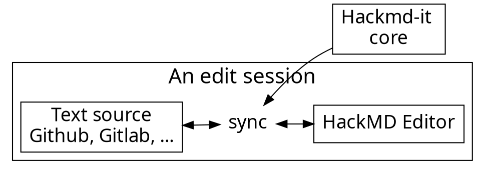

# KLENIK!

<!-- Put the link to this slide here so people can follow -->
slide: 

---


---

## Ini program ngapain?

- Menampilkan tabel data mengenai Jurusan pada FT UI beserta Departemen yang menaunginya, daya tampung, kuota SNMPTN, SBMPTN, SIMAK UI, PPKB dan kuota TS
- Menampilkan tabel data mengenai Jurusan pada FT UI beserta Kurikulum atau Mata Kuliah yang akan dipelajari serta Prospek Karir-nya
- User dapat menambahkan suatu jurusan sebagai jurusan yang ingin mereka ambil atau Wishlist 
- Terdapat forum diskusi dimana user dapat bertanya maupun menjawab serta membaca diskusi/thread yang ada
- User dapat melihat kembali Jurusan yang ingin mereka ambil pada laman Wishlist serta melihat mata kuliah yang akan dipelajari serta prospek karirnya

---

### 70% of our users are developers. Developers :heart: GitHub.

---



---

### Usage flow

---




---

### Architecture of extension

---


---

## Content script

- Bind with each page
- Manipulate DOM
- Add event listeners
- Isolated JavaScript environment
  - It doesn't break things

---

# :fork_and_knife: 

---

<style>
code.blue {
  color: #337AB7 !important;
}
code.orange {
  color: #F7A004 !important;
}
</style>

- <code class="orange">onMessage('event')</code>: Register event listener
- <code class="blue">sendMessage('event')</code>: Trigger event

---

# :bulb: 

---

- Dead simple API
- Only cares about application logic

---

```typescript
import * as Channeru from 'channeru'

// setup channel in different page environment, once
const channel = Channeru.create()
```

---

```typescript
// in background script
const fakeLogin = async () => true

channel.answer('isLogin', async () => {
  return await fakeLogin()
})
```

<br>

```typescript
// in inject script
const isLogin = await channel.callBackground('isLogin')
console.log(isLogin) //-> true
```

---

# :100: :muscle: :tada:

---

### Wrap up

- Cross envornment commnication
- A small library to solve messaging pain
- TypeScript Rocks :tada: 

---

### Thank you! :sheep: 

You can find me on

- GitHub
- Twitter
- or email me
